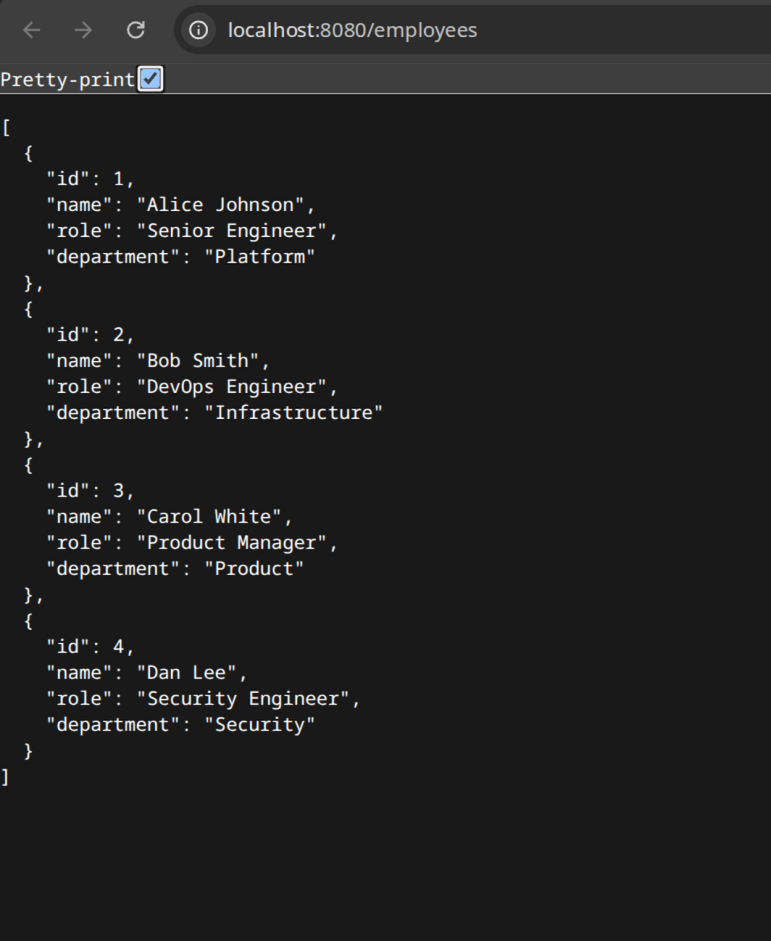

# Infrastructure Take Home

Treat this system as a production system.

## Getting Started

Clone this repository locally.
Create your own public git repository in github or somewhere we can access and push this code into it.
Make changes to your repository.
Getting things to work for you is part of the assessment.

You will be assessed by someone cloning your repository when you're finished and running your instructions to recreate the expected solution.
If we cannot run your repository instructions we cannot assess your work.

### Prerequsites

You will need the following:
* docker runtime and tools
* k3d CLI
* opentofu binary or terraform
* kubectl binary
* git

## Starting point

Use terraform or opentofu to initialise a k3d cluster and postgres instance locally from the `tofu` directory.
Install Argo CD into the k3d cluster by following the instructions in the `argocd` directory.

# Problem

Please add commits to your fork of the repo to answer this problem.
Note: the use of the word `postgrest` is confusing, but correct - this is a project that we're going to deploy.

## Add a user to the database

Please add a super user to the postgrest database.

## Inject a secret for postgrest

Creating a superuser account in this new database, inject the secrets into the k3d cluster into a namespace called postgrest.
You must do this with terraform/opentofu.

## Install Postgrest into the k3d cluster

https://docs.postgrest.org/en/v14/

The result should be an accessible endpoint that you can use in your browser.

## Inject some data from the cluster using a `Job`

Use a kubernetes job to inject some data into the postgres database

## Provide an expected screenshot

Update this file, README.md, with a screenshot of what we should see when we visit the URL after following your instructions - this should show us the data you have injected.

## Setup

Full instructions are in [`docs/setup.md`](docs/setup.md). Quick reference in [`docs/running-short.md`](docs/running-short.md).

Two things worth noting:

**ArgoCD wait** — wait for all deployments, not just `argocd-server`:
```bash
kubectl wait --for=condition=available deployment --all -n argocd --timeout=120s
```
ArgoCD uses a separate `argocd-repo-server` to clone git repos and read manifests. If you only wait for `argocd-server` (which starts faster), the first sync attempt fails because the repo-server isn't ready yet — then ArgoCD waits ~3 minutes before retrying.

**OpenTofu** — the kubernetes provider was replaced with `terraform_data` + `local-exec` kubectl. The kubernetes provider validates the kubeconfig context at init time, before the cluster exists, which causes `tofu apply` to fail on a fresh machine. Using kubectl inside `local-exec` avoids this — it only runs during apply, after the cluster is created.

## Expected Result

Visit `http://localhost:8080/employees` after running the setup instructions.


